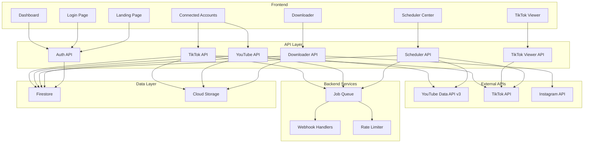

# SkeTools Improvement Plan

## Executive Summary

This plan outlines comprehensive improvements to the SkeTools web application, focusing on:
1. Modern boxy/geometric design system
2. Full YouTube and TikTok API integration for auto-upload
3. Enhanced Reels downloader with better UX
4. Improved TikTok account viewer with analytics
5. Complete redesign of landing page, login, and dashboard

## Current State Analysis

### Existing Features
- ✅ Basic landing page with hero section
- ✅ Login page with dev authentication
- ✅ Dashboard with quick links
- ✅ Instagram Reels downloader (single & mass)
- ✅ Scheduler center (basic form)
- ✅ TikTok viewer (basic search)
- ✅ Connected accounts page (placeholder)
- ✅ Dark/light theme toggle
- ✅ Firebase + Supabase backend setup

### Technology Stack
- **Frontend**: Next.js 16.2.0, React 19.2.4, Tailwind CSS 4
- **Backend**: Next.js API Routes, Firebase Admin, Supabase
- **Database**: Firestore (Firebase)
- **Authentication**: Custom session-based with dev fallback

---

## Design System Overhaul

### New Design Principles
1. **Boxy/Geometric Aesthetic**: Sharp corners, square cards, grid-based layouts
2. **Modern Gradients**: Vibrant color gradients for accents
3. **High Contrast**: Better readability in both light and dark modes
4. **Micro-interactions**: Smooth hover effects, transitions, and animations
5. **Responsive First**: Mobile-first approach with breakpoints

### Color Palette

#### Light Mode
```css
--background: #f8fafc
--foreground: #0f172a
--surface: #ffffff
--surface-strong: #f1f5f9
--muted: #64748b
--border: #e2e8f0
--primary: #6366f1 (Indigo 500)
--primary-foreground: #ffffff
--accent-1: #8b5cf6 (Violet 500)
--accent-2: #ec4899 (Pink 500)
--accent-3: #06b6d4 (Cyan 500)
```

#### Dark Mode
```css
--background: #0f172a
--foreground: #f1f5f9
--surface: #1e293b
--surface-strong: #334155
--muted: #94a3b8
--border: #334155
--primary: #818cf8 (Indigo 400)
--primary-foreground: #0f172a
--accent-1: #a78bfa (Violet 400)
--accent-2: #f472b6 (Pink 400)
--accent-3: #22d3ee (Cyan 400)
```

### Component Design Specifications

#### Buttons
- **Primary**: Solid primary color, sharp corners (0px border-radius)
- **Secondary**: Border only, sharp corners
- **Ghost**: No background, sharp corners
- **Size variants**: sm (32px), md (40px), lg (48px)

#### Cards
- **Base**: Sharp corners (0px or 4px max), subtle border
- **Hover**: Slight lift (translateY -2px), enhanced shadow
- **Active**: Scale down (0.98), darker border

#### Inputs
- **Default**: Sharp corners, subtle border
- **Focus**: Primary color border, ring effect
- **Error**: Red border, error message below

---

## Architecture Overview



---

## Detailed Implementation Plan

### Phase 1: Design System & UI Foundation

#### 1.1 Global CSS Updates
- Update [`globals.css`](src/app/globals.css) with new color variables
- Add boxy design utility classes
- Implement smooth transitions and animations
- Add custom scrollbar styling

#### 1.2 Reusable UI Components
Create new components in `src/components/ui/`:
- `button.tsx` - Button variants (primary, secondary, ghost)
- `card.tsx` - Card component with hover effects
- `input.tsx` - Input with validation states
- `badge.tsx` - Status badges
- `progress.tsx` - Progress bars
- `modal.tsx` - Modal/dialog component
- `dropdown.tsx` - Dropdown menu
- `tabs.tsx` - Tab navigation

#### 1.3 Layout Components
- Update [`app-shell.tsx`](src/components/app-shell.tsx) with new design
- Update [`dashboard-nav.tsx`](src/components/dashboard-nav.tsx) with boxy styling
- Create `sidebar.tsx` for desktop navigation
- Create `mobile-nav.tsx` for mobile menu

---

### Phase 2: Landing Page Redesign

#### 2.1 Hero Section
- Modern boxy layout with geometric shapes
- Animated gradient background
- Floating 3D elements (optional)
- Clear CTA buttons with hover effects

#### 2.2 Features Section
- Grid-based feature cards (4 columns)
- Icon boxes with sharp corners
- Hover lift effect
- Gradient accents

#### 2.3 Statistics Section
- Animated counters
- Progress bars for metrics
- Real-time data display

#### 2.4 Footer
- Modern grid layout
- Social media links
- Newsletter signup
- Legal links

---

### Phase 3: Login Page Redesign

#### 3.1 Login Form
- Centered boxy card
- Form validation with real-time feedback
- Loading states
- Error message display
- Remember me checkbox
- Forgot password link

#### 3.2 Visual Enhancements
- Animated background
- Logo animation
- Smooth transitions

---

### Phase 4: Dashboard Redesign

#### 4.1 Layout
- Sidebar navigation (desktop)
- Top bar with user menu
- Main content area with grid system

#### 4.2 Widgets
- Statistics cards with sparklines
- Activity feed with timeline
- Quick access cards
- Recent jobs list
- Connected accounts status

#### 4.3 Interactive Elements
- Draggable widgets
- Customizable layout
- Real-time updates

---

### Phase 5: Reels Downloader Enhancement

#### 5.1 UI Improvements
- Better preview grid with selection
- Download progress indicators
- Batch download queue
- Download history
- Retry failed downloads

#### 5.2 Features
- Single URL download
- Mass download by username
- Preview before download
- Select multiple reels
- Download to cloud storage

#### 5.3 API Enhancements
- Rate limiting
- Retry logic
- Progress tracking
- Error handling

---

### Phase 6: YouTube Integration

#### 6.1 Authentication
- OAuth 2.0 flow
- Token management
- Refresh token handling
- Multi-account support

#### 6.2 Upload Functionality
- Video upload with metadata
- Thumbnail upload
- Privacy settings
- Scheduling
- Progress tracking

#### 6.3 Management
- List uploaded videos
- Update video details
- Delete videos
- Analytics integration
- Comments management

#### 6.4 API Service Layer
Create `src/lib/youtube/`:
- `auth.ts` - OAuth authentication
- `upload.ts` - Video upload functions
- `videos.ts` - Video management
- `analytics.ts` - Analytics data
- `types.ts` - TypeScript types

---

### Phase 7: TikTok Integration

#### 7.1 Authentication
- OAuth 2.0 flow
- Token management
- Refresh token handling
- Multi-account support

#### 7.2 Upload Functionality
- Video upload with metadata
- Hashtag management
- Privacy settings
- Scheduling
- Progress tracking

#### 7.3 Management
- List uploaded videos
- Update video details
- Delete videos
- Analytics integration
- Comments management

#### 7.4 API Service Layer
Create `src/lib/tiktok/`:
- `auth.ts` - OAuth authentication
- `upload.ts` - Video upload functions
- `videos.ts` - Video management
- `analytics.ts` - Analytics data
- `types.ts` - TypeScript types

---

### Phase 8: TikTok Viewer Enhancement

#### 8.1 Search Improvements
- Advanced filters (date range, views, likes)
- Sort options
- Search history

#### 8.2 Video Preview
- Inline video playback
- Full-screen mode
- Download option
- Share functionality

#### 8.3 Analytics Display
- Views, likes, shares, comments
- Engagement rate
- Growth trends
- Compare with competitors

#### 8.4 Export Features
- Export to CSV
- Export to PDF
- Save to favorites

---

### Phase 9: Connected Accounts Management

#### 9.1 YouTube Accounts
- Connect account button
- OAuth flow
- Account list with status
- Disconnect option
- Set default account

#### 9.2 TikTok Accounts
- Connect account button
- OAuth flow
- Account list with status
- Disconnect option
- Set default account

#### 9.3 Account Status
- Connection status indicator
- Last sync time
- Token expiry warning
- Reconnect button

---

### Phase 10: Scheduler Center Enhancement

#### 10.1 Calendar View
- Monthly/weekly/daily views
- Drag-and-drop scheduling
- Color-coded by platform
- Conflict detection

#### 10.2 Schedule Form
- Platform selection
- Video source (URL, Drive, upload)
- Metadata input
- Recurring options
- Timezone support

#### 10.3 Queue Management
- Queue list with status
- Priority settings
- Pause/resume
- Cancel scheduled uploads

---

### Phase 11: Backend API Improvements

#### 11.1 Job Queue System
- Queue implementation (Bull or similar)
- Job priorities
- Retry logic
- Dead letter queue

#### 11.2 Webhook Handlers
- YouTube upload status
- TikTok upload status
- Error notifications
- Success notifications

#### 11.3 Rate Limiting
- Per-user limits
- Per-platform limits
- Exponential backoff
- Circuit breaker pattern

#### 11.4 Error Handling
- Comprehensive error types
- User-friendly error messages
- Error logging
- Monitoring integration

---

### Phase 12: Database & Storage

#### 12.1 Firestore Schema Updates

**YouTube Videos Collection**
```typescript
interface YouTubeVideo {
  id: string;
  userId: string;
  youtubeVideoId: string;
  title: string;
  description: string;
  thumbnailUrl: string;
  status: 'uploading' | 'uploaded' | 'failed';
  privacy: 'public' | 'unlisted' | 'private';
  scheduledAt?: Date;
  uploadedAt?: Date;
  views: number;
  likes: number;
  comments: number;
  createdAt: Date;
  updatedAt: Date;
}
```

**TikTok Videos Collection**
```typescript
interface TikTokVideo {
  id: string;
  userId: string;
  tiktokVideoId: string;
  caption: string;
  hashtags: string[];
  status: 'uploading' | 'uploaded' | 'failed';
  privacy: 'public' | 'friends' | 'private';
  scheduledAt?: Date;
  uploadedAt?: Date;
  views: number;
  likes: number;
  shares: number;
  comments: number;
  createdAt: Date;
  updatedAt: Date;
}
```

**Schedules Collection**
```typescript
interface Schedule {
  id: string;
  userId: string;
  platform: 'youtube' | 'tiktok';
  videoUrl: string;
  title: string;
  description?: string;
  hashtags?: string[];
  scheduledAt: Date;
  status: 'pending' | 'processing' | 'completed' | 'failed';
  retryCount: number;
  maxRetries: number;
  createdAt: Date;
  updatedAt: Date;
}
```

**Connected Accounts Collection**
```typescript
interface ConnectedAccount {
  id: string;
  userId: string;
  platform: 'youtube' | 'tiktok';
  accountId: string;
  accountName: string;
  accessToken: string;
  refreshToken: string;
  tokenExpiresAt: Date;
  isDefault: boolean;
  status: 'active' | 'expired' | 'revoked';
  lastSyncAt: Date;
  createdAt: Date;
  updatedAt: Date;
}
```

#### 12.2 Storage Structure
- `/videos/{userId}/{platform}/{videoId}/`
- `/thumbnails/{userId}/{platform}/{videoId}/`
- `/downloads/{userId}/{platform}/{date}/`

---

### Phase 13: Testing & Documentation

#### 13.1 Unit Tests
- API route tests
- Service layer tests
- Component tests
- Utility function tests

#### 13.2 Integration Tests
- OAuth flow tests
- Upload flow tests
- Scheduler tests
- End-to-end tests

#### 13.3 Documentation
- API documentation (OpenAPI/Swagger)
- User guide
- Developer guide
- Troubleshooting guide
- Deployment guide

---

## Implementation Priority

### High Priority (MVP)
1. Design system foundation
2. Landing page redesign
3. Login page redesign
4. Dashboard redesign
5. YouTube OAuth integration
6. TikTok OAuth integration
7. Basic upload functionality
8. Scheduler improvements

### Medium Priority
1. Reels downloader enhancements
2. TikTok viewer improvements
3. Connected accounts management
4. Advanced scheduling features
5. Analytics integration

### Low Priority
1. Advanced animations
2. Export features
3. Competitor comparison
4. Multi-account management
5. Advanced analytics

---

## Technical Considerations

### Security
- Secure token storage (encrypted)
- Rate limiting to prevent abuse
- Input validation and sanitization
- CORS configuration
- CSRF protection

### Performance
- Image optimization
- Lazy loading
- Code splitting
- Caching strategies
- CDN for static assets

### Scalability
- Horizontal scaling readiness
- Database indexing
- Queue system for background jobs
- Monitoring and logging
- Error tracking

### Accessibility
- ARIA labels
- Keyboard navigation
- Screen reader support
- Color contrast compliance
- Focus indicators

---

## Dependencies to Add

```json
{
  "dependencies": {
    "googleapis": "^140.0.0",
    "tiktok-api": "^1.0.0",
    "bull": "^4.12.0",
    "ioredis": "^5.3.0",
    "zod": "^3.22.0",
    "react-hook-form": "^7.51.0",
    "date-fns": "^3.3.0",
    "recharts": "^2.12.0",
    "framer-motion": "^11.0.0",
    "lucide-react": "^0.344.0"
  },
  "devDependencies": {
    "@types/bull": "^4.10.0",
    "vitest": "^1.4.0",
    "playwright": "^1.42.0"
  }
}
```

---

## Environment Variables

```env
# YouTube
YOUTUBE_CLIENT_ID=your_client_id
YOUTUBE_CLIENT_SECRET=your_client_secret
YOUTUBE_REDIRECT_URI=http://localhost:3000/api/youtube/callback

# TikTok
TIKTOK_CLIENT_KEY=your_client_key
TIKTOK_CLIENT_SECRET=your_client_secret
TIKTOK_REDIRECT_URI=http://localhost:3000/api/tiktok/callback

# Redis (for job queue)
REDIS_URL=redis://localhost:6379

# Storage
STORAGE_BUCKET=sketools-videos
```

---

## Success Metrics

- ✅ Design system implemented across all pages
- ✅ YouTube OAuth flow working
- ✅ TikTok OAuth flow working
- ✅ Video upload to YouTube successful
- ✅ Video upload to TikTok successful
- ✅ Scheduler creating and executing jobs
- ✅ All pages responsive on mobile/tablet
- ✅ Dark mode working correctly
- ✅ Load time under 2 seconds
- ✅ 95%+ test coverage for critical paths

---

## Next Steps

1. Review and approve this plan
2. Set up development environment with new dependencies
3. Begin Phase 1: Design System & UI Foundation
4. Implement features in priority order
5. Test thoroughly at each phase
6. Deploy to staging environment
7. Gather feedback and iterate
8. Deploy to production

---

## Questions & Considerations

1. **YouTube API Quota**: YouTube Data API has daily quotas. Need to implement quota management.
2. **TikTok API Access**: TikTok API requires approval. Need to apply for developer access.
3. **Video Storage**: Where to store uploaded videos? Cloud Storage, S3, or local?
4. **Job Queue**: Use Redis/Bull or a simpler solution for MVP?
5. **Monitoring**: Need monitoring and alerting for production?
6. **Cost**: Estimate monthly costs for API usage, storage, and hosting.
